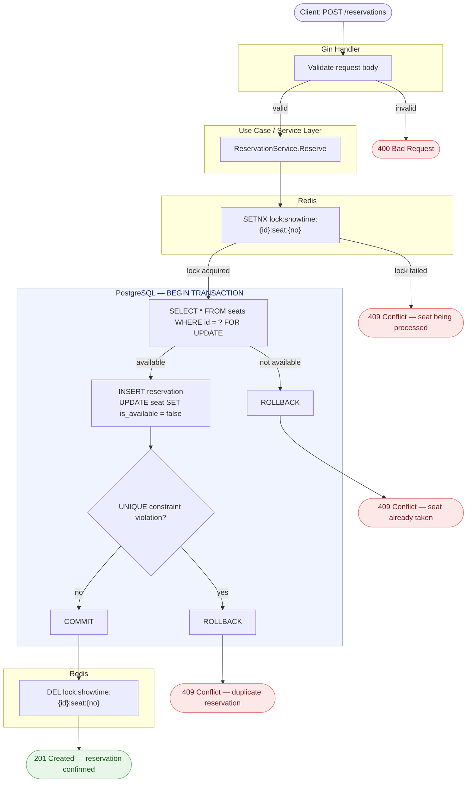

```mermaid
    flowchart TD
A([Client: POST /reservations]) --> B

    subgraph GIN ["Gin Handler"]
        B[Validate request body]
    end

    B -- invalid --> ERR1([400 Bad Request])
    B -- valid --> C

    subgraph SVC ["Use Case / Service Layer"]
        C[ReservationService.Reserve]
    end

    C --> D

    subgraph REDIS ["Redis"]
        D["SETNX lock:showtime:{id}:seat:{no}"]
    end

    D -- lock failed --> ERR2([409 Conflict — seat being processed])
    D -- lock acquired --> E

    subgraph TX ["PostgreSQL — BEGIN TRANSACTION"]
        E["SELECT * FROM seats WHERE id = ? FOR UPDATE"]
        E -- not available --> F1[ROLLBACK]
        E -- available --> F2["INSERT reservation\nUPDATE seat SET is_available = false"]
        F2 --> F3{UNIQUE constraint violation?}
        F3 -- yes --> F4[ROLLBACK]
        F3 -- no --> F5[COMMIT]
    end

    F1 --> ERR3([409 Conflict — seat already taken])
    F4 --> ERR4([409 Conflict — duplicate reservation])
    F5 --> G

    subgraph REDIS2 ["Redis"]
        G["DEL lock:showtime:{id}:seat:{no}"]
    end

    G --> H([201 Created — reservation confirmed])

    style ERR1 fill:#fde8e8,stroke:#e57373,color:#7f1d1d
    style ERR2 fill:#fde8e8,stroke:#e57373,color:#7f1d1d
    style ERR3 fill:#fde8e8,stroke:#e57373,color:#7f1d1d
    style ERR4 fill:#fde8e8,stroke:#e57373,color:#7f1d1d
    style H   fill:#e8f5e9,stroke:#66bb6a,color:#1b5e20
    style TX  fill:#f0f4ff,stroke:#90a4ae,color:#1a237e

```
